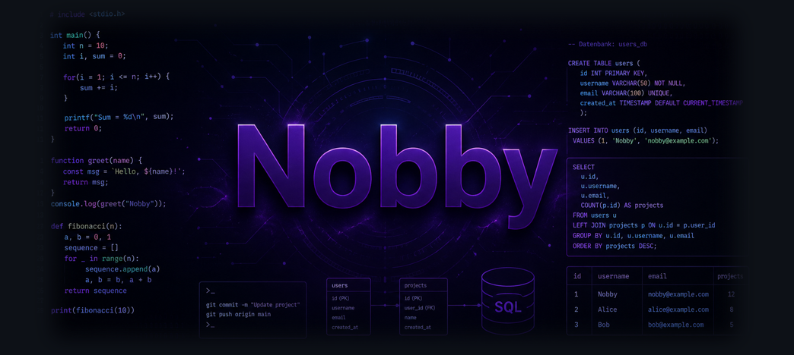

# Welcome to my GitHub

  

  :wave:  Ich hab mein Berufsleben auf den Kopf gestellt und mich umorientiert. Ich bin auf einem guten Weg, ein Data Analyst zu werden.
  
   
  

 
 

###
##  Training Provider
 
<table >
<tr>
<td></td>
<td style="padding-left: 11px;">
Data Analyst 
Smart Future Campus
</td>
</tr>
</table>
 
 
## Preferred Tech Stack
SQL (PostgreSQL, T-SQL)
<h3> Backend / Data </h3> 
<h2>SQL</h2>   currently learning 

